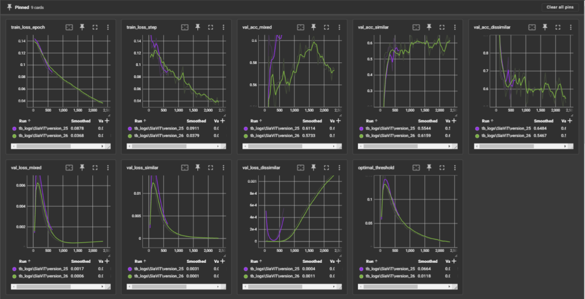

# Harmonixr
*A deep learning MIDI vectorization and music attribution system*

## Summary

Harmonixr is a set of foundational tools for interpreting MIDI, leveraging deep neural networks to generate vector embeddings of MIDI files. In this repo, we advance the SiaViT architecture, demonstrate the impressive accuracy of the SiaViT embeddings on the [GiantMIDI-Piano](https://github.com/bytedance/GiantMIDI-Piano) dataset that is robust to various hyperparameter selections, and present composer embeddings which subjectively align with traditional music theoretic understandings of stylistic similarity across composers. 

Check out our demo video here! [https://youtu.be/fOh5c4mRAGI](https://youtu.be/fOh5c4mRAGI)

## SiaViT

We propose the SiaViT (Siamese Vision Transformer) architecture as a novel means of modelling MIDI data. This architecture consists of shared parameters across two ViT heads. Each ViT head takes as input the 3D tensor described in the Dataset (4D including the batch dimension) and applies the following layers:

 - 3D convolutional layers as described in the Convolutions section
 - A linear feature transform reducing the dimensionality of extracted patches to the input dimension of the transformer encoder
 - A transformer encoder
 - Linear layers reducing to the final embedding dimension

We then train our model on our data as subsamples of randomly selected pairs, limiting our input data up to an arbitrary number of time steps (e.g. 1 minute) in order to restrict the size of the transformer encoder.

### Convolutions

In order to enable our model to learn kernels over both pitch and octave in a way that is agnostic to the selection of the "lowest" and "highest" pitch within an octave, we propose rolled wraparound convolutions, implemented as `WraparoundConv3D` in `model.py`. 

In order to improve the speed and consistency of training convergence across deeper models, we leverage residual convolutional layers extending the above with skip connections between every other convolutional layer.

### Optimization

We use the [AdamW](https://arxiv.org/abs/1711.05101) optimizer with weight regularization to mitigate overfitting. In order to maintain training stability, we schedule the learning rate via a warmup phase followed by cosine annealing.

We leverage the [contrastive loss function](https://ieeexplore.ieee.org/abstract/document/1640964) to optimize our model. In order to improve training stability and early convergence, we start with a low contrastive loss margin and dynamically recompute it according to the current loss on similar and dissimilar pairs.

As regularization we include dropout in our convolutional layers and transformer encoder.

## Dataset

We evaluate our model training on [GiantMIDI-Piano](https://github.com/bytedance/GiantMIDI-Piano), a dataset containing 10,800 piano pieces from over 2,700 different composers. 

<!-- We chose this dataset is due to its quality; the midi files capture notes with extremely high precision in timing and a level of detail in the velocities of notes not present in any previous piano dataset. -->

## Data preprocessing

We transform each MIDI file into a 3D tensor with dimensions pitch = 12, octave = 6, and time. Pitch and octave represent the 72 most common notes (F1 to E7) in the data set, and time represents the active notes being played for each 50ms time window in the midi file. Each value within a tensor is defined as 0 when a note is not playing, or a time-decayed velocity to simulate the natural decrease in volume when a key in a piano is played.

## Evaluation

To validate accuracy, we separate out a validation set of MIDI files and define separate "psuedovalidation", same-pair validation, different-pair validation, and mixed validation dataloaders. We define an accuracy metric as the proportion of MIDI pairs correctly predicted as being composed by the same or different composer based on an arbitrary threshold; we then use the psuedovalidation dataset to find an optimal threshold while mitigating overfitting our accuracy metric's threshold to the validation set. We then validate contrastive loss with a static margin and accuracy on each of the other validation dataloaders.

Above, a selection of TensorBoard charts is shown with various evaluation metrics over training iterations.

## Reproducability

In order to reproduce our result, follow the below steps:

 - `pip install -r requirements.txt`
 - Unzip `data.zip` to `data/*.*`
 - `python train.py`
